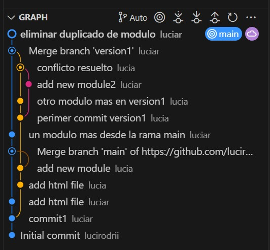

# **DawAct1_4**
## Este repositorio contiene los nombres de los módulos correspondientes al grado superior de Desarrollo de Aplicaciones Web. El objetivo es practicar conceptos de **Git**, *GitHub* y **Markdown**.

## **Descripción**
### Este repositorio permite:

#### - Añadir, editar o eliminar módulos.
#### - Crear ramas, unirlas o diversificarlas.

## **URL del repositorio:** [enlace](https://github.com/lucirodrii/DawAct1_4.git)

### Así se ve el historial del repositorio:


### El contenido del archivo index.html es el siguiente:

```html 
<!DOCTYPE html>
<html lang="en">

<head>
    <meta charset="UTF-8">
    <meta name="viewport" content="width=device-width, initial-scale=1.0">
    <title>Document</title>
</head>

<body>
    <h1>Módulos de Desarrollo de Aplicaciones Web</h1>
    <ul>
        <li>Despliegue de Aplicaciones Web</li>
	<li>Diseño de Interfaces</li>
        <li>Sostenibilidad aplicada al sistema productivo</li>         
	<li>Desarrollo Web en entorno servidor<li>
	<li>Digitalización aplicada al sistema productivo<li>
        <li>Desarrollo Web en entorno cliente</li>
    </ul>
</body>

</html> 
``` 